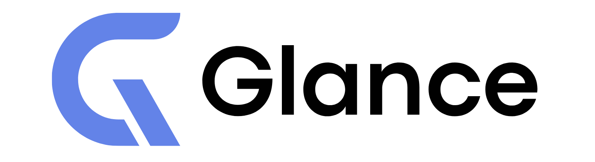

<p align="center">
  
</p>

<p align="center">
  <b>Make Claude <i>glance</i>, not stare.</b> — a token-efficient computer-use layer for Claude Code.
</p>

---

Claude controls your Mac with far fewer screenshot tokens and model round-trips, on
your **Pro/Max subscription (no API key)**.

The default computer-use loop sends a full ~1,500-token screenshot on **every** step.
Glance attacks that on three fronts: skip screenshots that didn't change, read the UI
as cheap **text** instead of pixels when possible, and **batch** whole action
sequences into one model round-trip. Measured ~40% fewer tokens on real tasks.

## Quick start (macOS, ~5 min)

Requirements: macOS · Python 3.10+ · Claude Code on a **Pro/Max** plan.

```bash
git clone https://github.com/soovittt/Glance.git glance && cd glance
python3 -m venv .venv && source .venv/bin/activate
pip install -e ".[mcp]"

# register the efficient computer-use server with Claude Code:
claude mcp add glance-cua -- "$(pwd)/.venv/bin/python" -m glance.mcp_server
```

Then:
1. **Grant permission** — the first computer-use call prompts for macOS
   **Accessibility + Screen Recording**; approve both (Screen Recording may need a
   Claude Code restart).
2. **Open a new Claude Code session** and give it a desktop task, e.g.
   *"open Calculator and work out 48 × 12."*
3. It drives your Mac through glance-cua — skipping unchanged screenshots, reading the
   accessibility tree, and batching actions.
4. Ask it to **call `session_report`** (or run `python hooks/session_report.py`) to see
   the efficiency: tokens by modality, round-trips saved, % vs a naive loop.

> It controls your **actual** desktop, so heavy native apps work — but the agent can
> click anything. Use a throwaway macOS user or VM if you don't want it touching real
> files.

## How it works — three levers + observability
- **Frame-skip (Glance):** an unchanged screenshot becomes a ~15-token note instead of
  a ~1,500-token image. Tuned to 100% accuracy / 0 missed changes on a labeled set.
- **Structured observation:** `ui_tree` reads the UI as text (10–50× cheaper than a
  screenshot); `click_element` / `type_into` act on elements **by name**.
- **Batching + procedure cache:** `computer_batch` runs a whole action sequence in one
  model round-trip; `task_begin` / `task_end` record a task once and replay it
  instantly, re-finding moved elements via accessibility anchoring.
- **Telemetry:** every tool call is measured; `session_report` shows exactly where
  tokens and round-trips go, so you tune from data.

### Tools the server exposes

| Tool | What it does |
|---|---|
| `computer_screenshot` | capture the screen (skipped → text note when unchanged) |
| `computer_click` / `computer_move` / `computer_drag` | mouse: click, move, drag |
| `computer_type` / `computer_key` | keyboard: type text, press a combo (e.g. `cmd+space`) |
| `computer_scroll` | scroll at a point |
| `open_app` | launch an app via `open -a` — **reliable**, no Spotlight fumbling |
| `wait` | pause for the UI to settle (capped 10s) |
| `frontmost_app` | name of the focused app — confirm a launch worked |
| `ui_tree` | **the frontmost app's UI as structured text** (role/name/coords) — ~10–50× cheaper than a screenshot and precise; screenshot only as a fallback |
| `click_element` / `type_into` | act on an element **by name** via the accessibility tree — no pixel hunting, no screenshot |
| `computer_batch` | run a **sequence of actions in one call** (no model round-trip between them), one screenshot at the end — collapses the 1-screenshot-1-action loop |
| `task_begin` / `task_end` | record a task once; replay it instantly next time |
| `session_report` | **cross-tool observability** — screenshots vs ui_tree vs batches, tokens by modality, round-trips saved, % vs a naive loop |
| `glance_stats` / `glance_log` | savings + cached tasks; tail the log |

Coordinates are in a 1366-px-wide space that preserves your screen's aspect ratio,
so clicks land accurately on any monitor.

### Tracking what it does (logging)

Everything is logged — every screenshot decision (SEND/SKIP, % changed, tokens, the
running savings total), every action, and every task record/replay. Three ways to
watch it (logs never go to stdout — that's the MCP channel):

```bash
tail -f ~/.glance/glance.log          # live, in a terminal
```
- the `glance_log` tool — read the tail from inside Claude Code
- stderr — captured in Claude Code's MCP server logs

Sample:
```
screenshot SEND changed=100.00% img=1399tok | session: 0/1 skipped, saved 0 tok (0%)
action {'action': 'click', 'x': 100, 'y': 200, ...}
screenshot SKIP changed= 0.00% img=1399tok | session: 1/2 skipped, saved 1384 tok (49%)
```
Set `GLANCE_LOG=/path/to/log` to change the location.

### Or: augment Claude's *built-in* computer use (hook mode)

Don't want to swap in glance-cua's tools at all? A `PostToolUse` hook lets Glance ride
on Claude Code's **own** computer use: it intercepts each screenshot result and, when
the screen didn't change, replaces the image with a text note via `updatedToolOutput` —
so Anthropic's computer use stays exactly as-is and just gets cheaper. Full telemetry
(`telemetry.jsonl` + an `analyze.py` report) ships with it. See
[`hooks/README.md`](hooks/README.md). *(Requires Claude Code ≥ 2.1.121.)*

---

## Why this exists (the honest version)

I read Anthropic's open-source computer-use reference loop to see what's *already*
optimized. Credit where due — it already:

- ✅ caches the static system prompt + tool definitions (prompt caching)
- ✅ downscales screenshots to a target resolution
- ✅ trims *old* screenshots out of history (`only_n_most_recent_images`)

But two things it does **not** do, confirmed in the code:

- ❌ **Inter-frame skipping.** It still sends a brand-new full screenshot of the
  *current* screen every step, even if you typed one character and 99% of the
  screen is identical to the last frame. → **Layer 1 (`Observer`)**.
- ❌ **Action/trajectory reuse.** No memory of "I've done this task before, here are
  the clicks." Every run starts from scratch. → **Layer 2 (`MacroCache`)**.

[OSWorld-Human](https://arxiv.org/abs/2506.16042) (2025) found agents take
**2.7–4.3× more steps than necessary** and end-to-end latency hits *tens of minutes*.
Almost everyone optimizes task **success rate**; almost nobody measures or optimizes
**tokens / steps / latency**. Glance does the latter, and ships a benchmark to prove it.

---

## How it works

You — not Claude — run the agent loop. Claude is the brain; your code is the eyes
and hands. So there's a seam between "take screenshot" and "send to Claude" where
Glance lives:

```
take screenshot ──► [ Glance: did it change? ] ──► send to Claude
                          │                │
                  changed │                │ unchanged
                          ▼                ▼
                   full image      "no visual change" note (~15 tokens)
```

When unchanged, Claude still has the previous real screenshot in its history, so the
note is enough for it to keep going. The diff is a full-resolution `cv2.absdiff`
(~1–2 ms, vectorized C) — accurate enough to catch a single typed character, and
~0.1% of a step's latency, so there's no reason to make it faster.

### Layer 2: procedure cache (`TaskCache`) — the latency lever

Glance (Layer 1) makes each step *cheaper*; the procedure cache makes repeat tasks
*faster* — record a task once, replay it instantly forever.

```
task_begin("compute 7x8 in calculator")   # 1st time: "recording, do the task"
  ... agent does it normally ...
task_end()                                 # saves the action sequence

task_begin("compute 7x8 in calculator")   # 2nd time: REPLAYS all of it in ~2s,
                                           #   zero model round-trips, you're done
```

**Why this works where pixel-state caching doesn't:** a whole-screen fingerprint
can't tell a calculator showing `7` from one showing `7x8` — the difference is below
its resolution — so keying on pixel state collides and goes ambiguous. Keying on the
**task label** doesn't collide. The fingerprint is used only to **verify** each
replayed step (abort to the model on gross drift: wrong window, app didn't open), and
a start-state check makes sure replay begins from where it was recorded. Persists
across sessions; `task_forget` / `task_list` manage entries.

Best for deterministic, same-layout repeat tasks. Coordinate-based replay is
intentionally simple — re-grounding (re-locating moved elements) is on the roadmap.

---

## Install

```bash
pip install -e .            # from this repo
# or, once published:  pip install glance-cua
```

Dependencies are just `numpy` + `opencv-python-headless`.

## Run the benchmark (no API key, no VM needed)

```bash
python bench/make_synthetic_trace.py    # generate a sample screenshot trace
python bench/harness.py                 # measure Glance on vs off
```

Example output:

```
Trace: bench/traces/synthetic  (30 frames)

                     tokens   images sent   diff time
  baseline           36864            30        14.2ms
  glance             24591            20        15.1ms

  frames skipped : 10/30 (33%)
  >>> SAVED      : 12273 tokens (33% fewer image tokens)
```

Point it at your own captured frames with `--frames path/to/dir`.

## Accuracy & safety (the self-improving loop)

Token savings are worthless if Glance ever skips a frame that *did* change — that
blinds the agent. So skipping is tuned against a **labeled dataset** of realistic
frame pairs (`bench/eval.py`) with one hard rule: **a real change must never be
skipped** (`missed_changes == 0`).

The decision logic (`glance/decide.py`) and its thresholds were converged by an
auto-tuning loop (`make loop`):

| iteration | change | accuracy | missed changes | skip rate |
|---|---|---:|---:|---:|
| 1 (baseline) | fixed `skip_threshold=0.002` | 87.5% | 12 ❌ | 100% |
| 1 (tuned) | low threshold **+** caret suppression | 100% | 0 ✅ | 100% |
| 2 (regress) | added cursor-move cases | 90.0% | 0 ✅ | 75% |
| 2 (fixed) | + cursor-motion suppression | **100%** | **0 ✅** | **100%** |

What the loop learned, and why each piece is needed:

- **Low skip threshold** so a single typed character (~1e-4 of the screen) is never
  missed — but alone this *sends* a frame on every cursor blink.
- **Caret suppression** (thin/tall/tiny region) recovers those blinks.
- **Cursor-motion suppression** (two small blobs, one lighter + one darker) skips
  pure mouse moves. The lighter/darker asymmetry is what keeps typed text — which is
  all-darker — from ever being mistaken for a cursor move.

```bash
make eval     # score the current policy
make tune     # grid-search for a better one
make loop     # measure -> tune -> validate
make guard    # fail if accuracy/safety ever regress (CI / Claude Code loop hook)
```

> Honest caveat: these numbers are on synthetic-but-realistic traces with known
> ground truth. The *algorithm* generalizes; the exact thresholds should be
> re-validated on real OSWorld/browser captures (see roadmap).

## Test

```bash
pip install -e ".[dev]"
pytest
```

## Test it against real Claude computer use

[`examples/run_browser_agent.py`](examples/run_browser_agent.py) is a **real**
Claude computer-use agent driving a **real** headless browser, with Glance on its
screenshot step — it runs an actual task and prints the real token savings on that
run.

```bash
pip install -e ".[examples]"
playwright install chromium
export ANTHROPIC_API_KEY=...
python examples/run_browser_agent.py --task "Go to example.com and click the 'More information' link"
```

For just the integration seam without the browser plumbing, see
[`examples/anthropic_loop.py`](examples/anthropic_loop.py) (the Glance line is
marked `# <-- GLANCE`).

---

## Tuning

```python
from glance import Observer, GlancePolicy

observer = Observer(GlancePolicy(
    skip_threshold=0.002,   # skip if <0.2% of pixels changed (raise = skip more)
    pixel_threshold=12,     # per-pixel delta to count as "changed" (filters noise)
    enabled=True,           # False = always send full image (the A/B baseline)
))
```

## Roadmap

- [x] Layer 1: inter-frame skip + benchmark harness
- [x] Accuracy/safety eval + auto-tuner (100% on labeled set, 0 missed changes)
- [x] Caret-blink + cursor-motion suppression
- [x] Layer 2: task-keyed procedure cache (record once, verified instant replay)
- [ ] Procedure re-grounding (re-locate moved elements instead of fixed coordinates)
- [ ] "Changed-region crop" mode with explicit coordinate framing
- [ ] Real OSWorld / browser task numbers (not just synthetic traces)

## License

MIT
